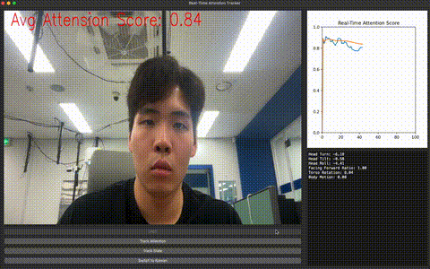
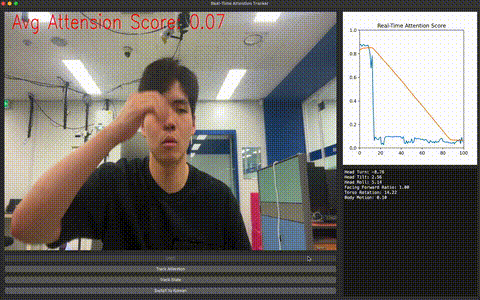
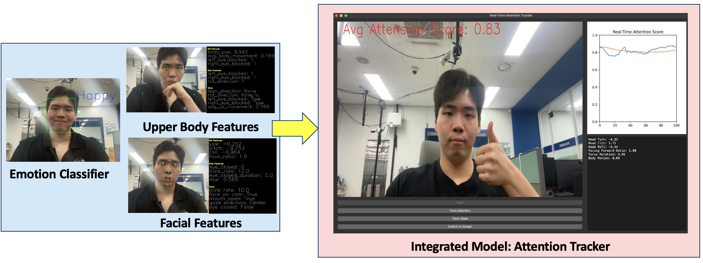
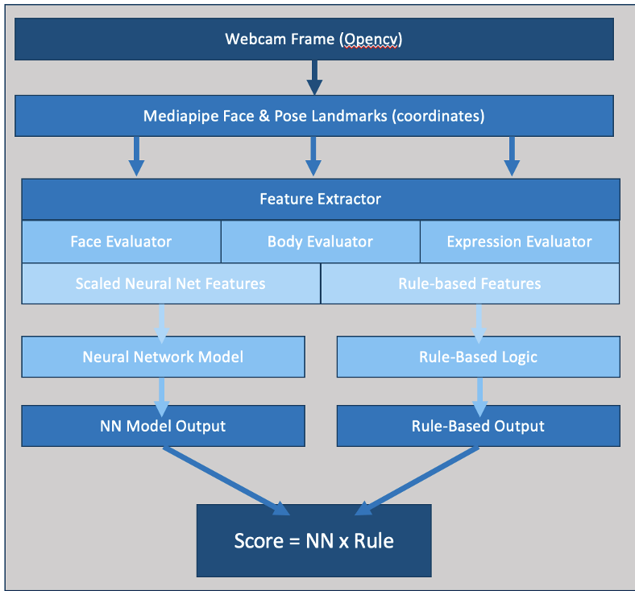

# Real-time Attention Tracker

This project implements a real-time attention tracking system using webcam input. It extracts facial landmarks, body posture, and facial emotion features using MediaPipe and deep learning models, then fuses them to compute an attention score. 
> This project was developed during my internship at **Robocare**, South Korea.
> This project is currently in development and not intended for commercial use. Contact me if you're interested in collaboration or usage.

<p align="center">
  
</p>

<p align="center">
  
</p>

---

## Table of Contents
- [Features](#features)
- [System Overview](#system-overview)
- [Folder Structure](#folder-structure)
- [Getting Started](#getting-started)
- [License](#license)
- [Author](#author)

---

## Features

- **Pose-based Posture Tracking** – detect leaning, rotation, and occlusion using MediaPipe Pose
- **Facial Feature Extraction** – head yaw/pitch/roll, gaze direction, blink detection using MediaPipe FaceLandmarker
- **Emotion Classification** – fine-tuned MobileNetV2 model classifies expressions (FER2013-based)
- **Real-time Inference** – unified system outputting attentiveness scores in real time

<p align="center">
  
</p>

---

## System Overview

This attention tracking system processes real-time webcam input and computes an attentiveness score using multimodal cues — including facial landmarks, body posture, and emotion recognition. It is designed to be modular, lightweight, and interpretable for applications in education, robotics, and human-computer interaction.

The diagram below illustrates the system pipeline. Webcam frames are processed through MediaPipe to extract pose and face landmarks. These are passed into evaluators that compute both neural network-compatible features and handcrafted rule-based indicators. The final attention score is a fusion of both neural and rule-based outputs.

<p align="center">
  
</p>

---

## Folder Structure
- `classifiers/` – Feature extractors and attention score model (face, body, emotion)
- `models/` – Pretrained model files (`.task`, `.pth`)
- `train/` – Training scripts and logs
- `data_set/` – Scaled datasets, min-max scalers, diagnostics
- `uiui.py` – Main real-time system script
- `emote_visualize.py` – Optional: emotion feature viewer
- `body_visualize.py` – Optional: body feature viewer
- `face_visualize.py` – Optional: facial feature viewer
- `requirements.txt` – Python dependencies
---

## Getting Started

### 1. Clone the repo
```bash
git clone https://github.com/cjmpark/Real-time-Attention-Tracker.git
cd Real-time-Attention-Tracker
```

### 2. Install dependencies
```bash
pip install -r requirements.txt
```

### 3. Install Pretrained Models

Download and place the following files into the `models/` folder:

- **MediaPipe Face Landmarker**  
  [face_landmarker.task](https://storage.googleapis.com/mediapipe-models/face_landmarker/face_landmarker/float16/latest/face_landmarker.task)

- **MediaPipe Pose Landmarker (Lite)**  
  [pose_landmarker_lite.task](https://storage.googleapis.com/mediapipe-models/pose_landmarker/pose_landmarker_lite/float16/latest/pose_landmarker_lite.task)

- **Emotion Classifier (MobileNetV2 on FER2013)**  
  The emotion model (`emotion_model.pth`) is already included in this repository.  
  If you'd like to train your own, use the [FER2013 dataset on Kaggle](https://www.kaggle.com/datasets/msambare/fer2013).

### 4. Run
```python
python uiui.py
```

---

## License
This project is licensed under the **MIT License**.  
See the [LICENSE](LICENSE) file for full license text.

---

## Author

Developed by [@cjmpark](https://github.com/cjmpark) during an internship at **Robocare**, South Korea.

Feel free to fork, star, or open an issue for feedback or collaboration!


